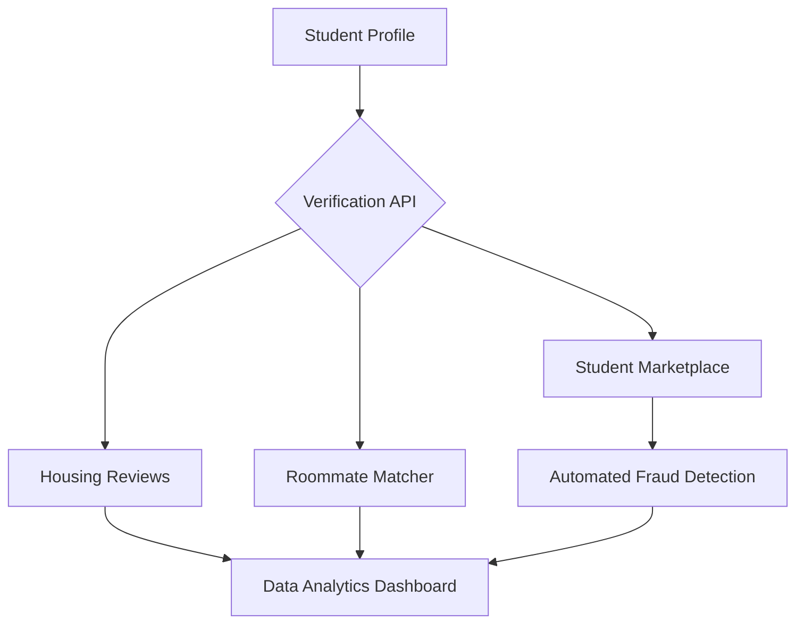

# USC Housing Digital Platform Initiative
**Role:** Technical Program Manager / Lead Analyst | **Project Budget:** $263,984

## 1. Executive Summary
Lead the strategic planning and lifecycle management of a mobile application designed to streamline the housing process for 50,000+ USC students. This initiative focused on centralizing housing reviews, roommate matching, and a student-to-student marketplace.

## 2. Technical Roadmap & Project Milestones
I managed the transition from initial discovery to a revised scope, handling a significant mid-project pivot.

| Phase | Key Deliverables | Status |
| :--- | :--- | :--- |
| **Discovery** | Stakeholder Surveys, User Requirements, Market Analysis | Completed |
| **Design** | Database Architecture, UI/UX Wireframes, Resource Planning | Completed |
| **Development** | Roommate Matching Logic, Marketplace Integration | Completed |
| **Deployment** | App Store Compliance, Post-Rollout Maintenance Plan | Completed |

## 3. Project Governance & Scope Management
A key highlight of this project was managing a **$76,836 budget increase** and a **2-month timeline extension**. I successfully reallocated resources from Marketing and R&D to cover engineering hours, ensuring project continuity.

### Risk Register & Mitigation
| Risk Category | Potential Impact | Mitigation Strategy |
| :--- | :--- | :--- |
| **Data Privacy** | Student identity exposure | Implemented strict student database verification protocols. |
| **Financial** | Budget overruns ($76k+) | Eliminated Legal Supervisor role; pivoted to internal USC Transportation SMEs. |
| **Technical** | Navigation inaccuracies | Integrated USC-specific parking and transportation data. |

## 4. Operational Flow
This diagram illustrates how I coordinated cross-functional teams to manage the platform's core services:

## 5. KPI & Performance Tracking
I designed a KPI framework to ensure the platform met its ROI goals post-launch, focusing on financial sustainability and platform integrity.

| Category | Success Metric | Baseline/Target | Strategic Objective |
| :--- | :--- | :--- | :--- |
| **Financial** | Budget Adherence | $263,984 Total Spend | Monitor and control capital expenditure (CAPEX). |
| **Financial** | OpEx Optimization | **$100/month** maintenance | Reduce recurring operational costs by 90% post-rollout. |
| **Growth** | Adoption Rate | 80% Student Body | Achieve critical mass for marketplace liquidity. |
| **Security** | Auth Integrity | 0% non-USC users | Enforce automated verification to prevent fraud. |

> **Analyst Note:** The transition from a $1,000/month maintenance cost to a **$100/month** model was achieved by streamlining support functions and utilizing internal USC cloud resources, directly impacting the long-term ROI of the initiative.

## 6. Tools & Methodologies
To ensure project success for the 50,000+ user base, I utilized industry-standard frameworks to balance the technical and operational requirements.

* **Project Management:** Work Breakdown Structure (WBS), Critical Path Method (CPM), and Milestone Tracking.
* **Change Management:** Organizational Change Management (OCM) plan to ensure student and stakeholder adoption.
* **Analytical Tools:** Resource Allocation matrices, Budget Forecasting, and Stakeholder Engagement maps.
* **Technical Framework:** Agile/Scrum methodology for the engineering sprints and API integrations.

## 7. Change Control & Revised Scope
A core competency demonstrated in this project was the ability to manage **Project Change Controls**. 

When the project faced a mid-cycle update requiring an additional **$76,836**, I led the following:
1.  **Impact Analysis:** Evaluated the 2-month delay on the launch schedule.
2.  **Resource Reallocation:** Pivoted from expensive external Legal Supervisors to internal USC Transportation SMEs.
3.  **Revised Goals:** Updated the project charter to prioritize the "Parking Navigation" and "Safety" modules over less critical features.

## 8. Conclusion & Key Takeaways
The USC Housing Digital Platform project served as a comprehensive exercise in managing high-stakes technical delivery within a complex stakeholder environment. 

### Professional Growth & Lessons Learned:
* **Adaptive Leadership:** Navigating a **$76k budget increase** taught me how to pivot resources without compromising the core project vision.
* **Data-Driven Decision Making:** By establishing a clear KPI framework, I moved the project from "feature-complete" to "value-driven," focusing on long-term ROI.
* **Cross-Functional Synergy:** Successfully bridged the gap between Engineering, Legal, and Operations, ensuring that technical constraints (APIs) met business needs (Fraud Prevention).
